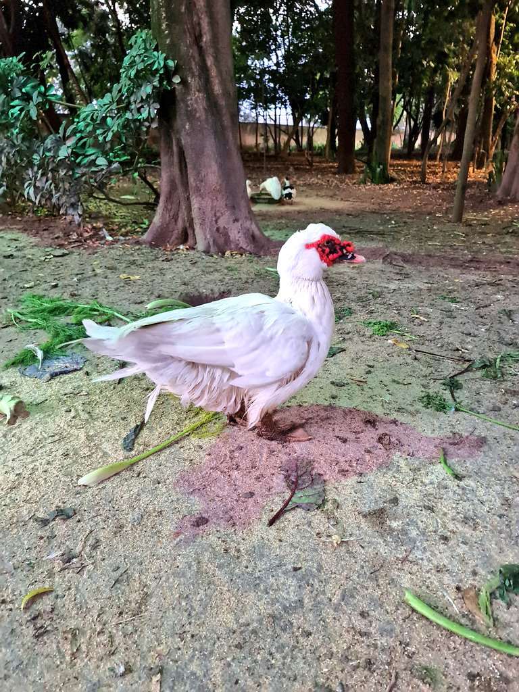

**Hello, it's nice to have you here!**

I am building this site to share my ideas and talk about things that I like. It is under heavy construction!

## Pages

- [[Catholicism]]
- [a](./a.html)

## About Me

I am a devout Roman Catholic ✝ (c. 2024) that likes to solve problems and build new things by writing software and talking to people.

The following is a port of the things in my old site. These will not be here for long, as I am planning on expanding and making new sections.

## Q&A

### Where can I follow you?

(please don't follow me in real life)

- You can send me a DM on [LinkedIn](https://www.linkedin.com/in/gustavo-depaula/)
- Follow my art page on [Twitter](https://twitter.com/ClassicalCharm)
- Let's play chess: [Chess.com](https://www.chess.com/member/dpgu)
- Here's my [GitHub](https://github.com/gustavo-depaula)

### Why do you use Comic Sans?

Because it's the best font ever invented, for everything. And because I know nothing about typography.

I also use it for coding and love it: [Comic Mono Font](https://github.com/dtinth/comic-mono-font)

Wholeheartedly recommend trying it. For me, it helped with me stopping misreading words and swapping letters/words.

There's also an interesting side-effect. People tend to unfairly ridicule Comic Sans. So the content you write on it needs to be really good to break through this initial prejudice.

### Do you have any hobbies?

I do! Glad you asked!

Here's a list of topics I'm interested in:

- Chess (add me on chess.com!)
- Language learning (currently learning 🇫🇷French 🇫🇷)
- Board Games, I really like these ones:
  - [High Society](https://boardgamegeek.com/boardgame/220/high-society)
  - [Root](https://boardgamegeek.com/boardgame/237182/root)
- Digital Games
  - [Factorio](https://www.factorio.com/)
  - [Civilization VI](https://store.steampowered.com/app/289070/Sid_Meiers_Civilization_VI/)
- Walking in the park
- Finance/Investing
- Discovering classical art through [Artvee](https://artvee.com/)
- Music
  - recently, I've bought a vinyl of _Future Nostalgia_ by Dua Lipa
  - let's do a [Spotify Blend](https://techcrunch.com/2021/08/31/spotify-officially-launches-blend-allowing-friends-to-match-their-musical-tastes-and-make-playlists-together/)!

### What's your favorite piece of (neo-)classical art?

**"When The Heart Is Young" (1902)**  
John William Godward (1861-1922) 🇬🇧

Download it here: [Artvee](https://artvee.com/dl/when-the-heart-is-young/)

### Have you watched Hamilton?

Yes. Yes. YES. Absolutely loved it.

Here's a list of some of my favorite lines:

> Hamilton doesn't hesitate  
> He exhibits no restraint  
> He takes and he takes and he takes  
> And he keeps winning anyway  
> He changes the game  
> He plays and he raises the stakes

> Why do you write like you're running out of time?  
> Write day and night like you're running out of time?

> And when my time is up  
> Have I done enough?

> Eliza, I don't have a dollar to my name  
> An acre of land, a troop to command, a dollop of fame  
> All I have's my honor, a tolerance for pain  
> A couple of college credits and my top-notch brain

> You have no control who lives, who dies, who tells your story  
> I know that we can win  
> I know that greatness lies in you  
> But remember from here on in, history has its eyes on you

> Love doesn't discriminate  
> Between the sinners and the saints  
> It takes and it takes and it takes  
> And we keep loving anyway

> Death doesn't discriminate  
> Between the sinners and the saints  
> It takes and it takes and it takes  
> And we keep living anyway

Here's also a list of things you should see after you've watched the musical:

- [Lin-Manuel Miranda Performs at the White House Poetry Jam](https://www.youtube.com/watch?v=WNFf7nMIGnE)
- [Hamilton cast performs "Alexander Hamilton" at White House](https://www.youtube.com/watch?v=ZPrAKuOBWzw)
  - (also watch the follow-ups: [YouTube Playlist](https://www.youtube.com/playlist?list=PLKV-NbgfXV0n71jqug5xZhjAUfqaTuau_). I was not able to find all the songs, if you find it, PLEASE send it to me.)
- [Hamilton and Motifs: Creating Emotional Paradoxes](https://www.youtube.com/watch?v=yWK1B1EiQ7U)
- [All deleted songs from Hamilton](https://www.youtube.com/watch?v=EZkANYGycNU)

Recommended readings:

- [The real-life election of 1800 was even wilder than Hamilton the musical lets on](https://www.vox.com/2015/11/28/9801376/hamilton-election-of-1800-burr-jefferson)
- [Hamilton's Financial Plan](https://www.ushistory.org/us/18b.asp)
- [Interactive Constitution](https://constitutioncenter.org/interactive-constitution)
- [Federalist No. 10](https://en.wikipedia.org/wiki/Federalist_No._10)
- [The Jefferson Monticello](https://www.monticello.org/)
  - especially [Paradox of Liberty](https://www.monticello.org/paradox/)
- [Elizabeth Schuyler Hamilton](https://en.wikipedia.org/wiki/Elizabeth_Schuyler_Hamilton)
  - a sad story: [Angelica Hamilton](https://en.wikipedia.org/wiki/Angelica_Hamilton)
- [Gilbert du Motier, Marquis de Lafayette](https://en.wikipedia.org/wiki/Gilbert_du_Motier,_Marquis_de_Lafayette)

### Where did you study?

I did high school at the Technical School of the Federal University of Minas Gerais (Coltec-UFMG). There, I graduated as a Technician in Systems Development. I'm grateful I had the opportunity to go there and glad I made the choice (one of the best I made in my life!).

Currently, I'm doing BSc Computer Science in a distance learning program at Goldsmiths, University of London.

### When will you graduate from your university?

Please don't ask.

### What languages do you speak?

Currently:

- 🇧🇷 Portuguese
- 🇺🇸 English

Learning:

- 🇫🇷 French

Want to learn:

- 🇪🇸 Spanish
- 🇮🇹 Italian

Maybe:

- 🇩🇪 German
- 🇮🇹 Italian

### By any chance, have you taken a photo of a majestic duck?

Yes, I do! This one was found in "Parque da Água Branca", São Paulo.

