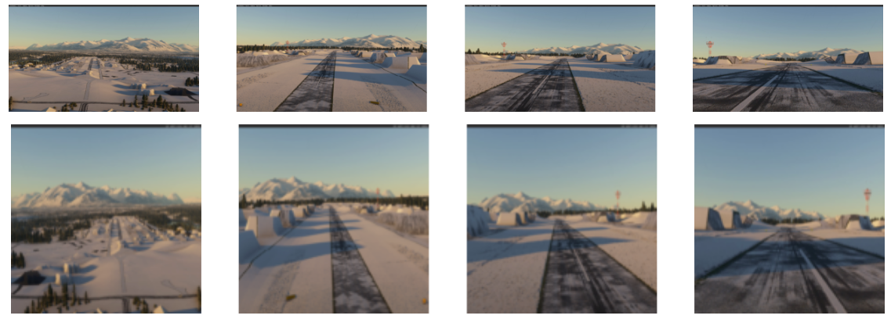
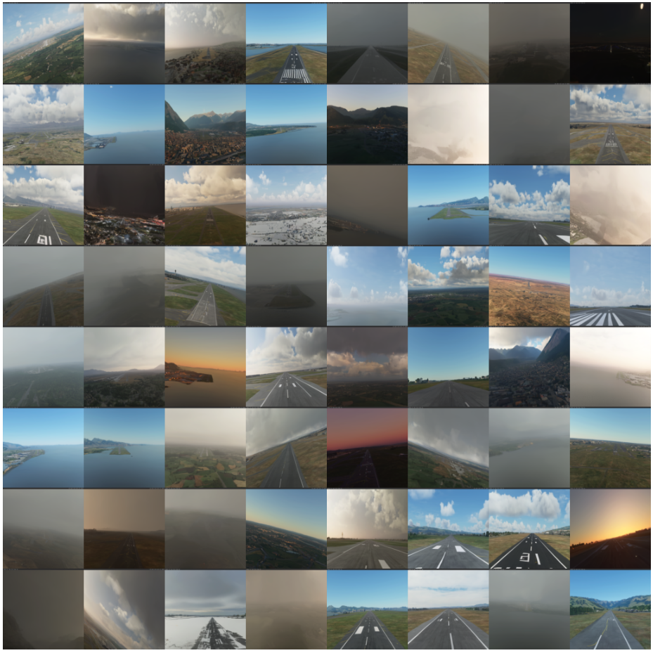

# Introduction

Aviation is regarded as highly safe medium of transportation, and is marked by high-degrees of automation, reducing the biggest cause (85% of the general aviation crashes) of accidents: pilot error [@li_factors_2001]. The increase in automation reduces cognitive, fatigue, and inexperience risks for pilots and is and important factor, alongside better training and safety regulations, to the to the rapidly decrease (1959-2024) in the fatal accidents rate [@airbus_fatal_nodate].

Although the approach and landing phases are the minority of the flight time, they contribute disproportionally to the number of accidents, this data being corroborated by the two major commercial airplane companies Boeing (7% in approach, 36% in landing) [@boeing_statistical_2024], and Airbus (59% in landing, 11% in approach) [@airbus_accidents_nodate].

Contributing as a risk-factor, the approach and landing phases are flight parts that require heavy human intervention. This has led to an increased interest in the development of autonomous landing (autoland) systems, which are systems that can autonomously navigate the civil aircraft or UAV (unmanned aerial vehicle, e.g. drones) during the landing procedure. Currently, most autoland systems are based on radio signals that provide guidance to the system, such as ILS (instrument landing system) and PAR (precision approach radar).

Radio-based autonomous landing systems have the advantage of allowing the landing in extremely adverse weather conditions and low visibility, but they have a high-cost of deployment and maintenance, can suffer from electromagnetic and radio interference, and require on-the-ground specialized equipment to support the aircraft (e.g. localizer and glideslope). (TODO: add reference?)

The recent advancements in the Computer Vision field have sparked increasing interest [@airbus_airbus_2021] in developing vision-based autoland systems, which use visual navigation to guide the aircraft during the approach and landing phases. In [@xin_vision-based_2022], the authors describe key advantages of vision-based autoland systems for UAV: autonomy, low cost, resistance to interference, and ability to be combined with other navigation methods for higher accuracy. Vision based landing is especially attractive for drones that often need to land in extreme situations when in military use, environmental monitoring, and disaster relief, where runways may not have the necessary equipment for radio-based systems.

Two key parts of a autonomous landing system is detection and segmentation of runways, the former being responsible for detecting the presence and locating the runway on the image by drawing a bounding box around the runway, and the latter, more granularly, works at the pixel-level, identifying the exact shape of the object on the image.

Detection and segmentation methods can be separated into two broad fields: traditional methods and deep-learning based methods. Traditional methods employ handcrafted features and mathematical rules to segment images, e.g. recognition of texture, line segments, and shape features of runways [@aytekin_texture-based_2013]  [@ye_research_2020]. They tend to be faster to run and not require training, but because they require handcrafted rules, they often fail to generalize to out-of-sample images and complex real-world scenarios that involve similar objects like roads and multiple runways and adverse weather conditions.

Compared to traditional methods, deep-learning based ones have shown improved generalization and performance on out-of-sample images, with the latest published runway segmentation papers all having used this approach and getting better results than traditional methods [@chen_image-based_2024]  [@wang_valnet_2024].

However, because of their data-hungry nature, previous research [@wang_valnet_2024]  [@chen_image-based_2024]  [@chen_bars_2023]  [@ducoffe_lard_2023] all note the lack of publicly available, high-quality, large, real-world datasets of aeronautical images to be used in the task of runway segmentation. To close this gap, the researchers have built and published datasets comprised of synthetic images collected from flight simulators such as X-Plane [@chen_bars_2023]  [@wang_valnet_2024], Microsoft Flight Simulator [@chen_image-based_2024], and images collected from Google Earth Studio [@ducoffe_lard_2023].

While these synthetic datasets have contributed to advancements in the field, there still an opportunity of an open-source, realistic, high-quality dataset that has runway image data encompassing a greater variety of weather and lighting conditions, environments and runway structures, and, even better, an open-source image generator that is capable of generating novel images or augmenting an existing dataset.

In recent years, striking advancements were made in the field of image generation models, with several closed-source and open-source models being published for general use, such as DALL-E [@betker_improving_nodate], Midjourney [@midjourney_midjourney_nodate], Kandinsky [@arkhipkin_kandinsky_2024], and Stable Diffusion [@rombach_high-resolution_2022]. These recently state-of-the-art models are latent diffusion models (LDM), which have surpassed in performance the previous state-of-the-art techniques that were based in generative adversarial networks (GANs). These image-generation models are now so capable of generating realistic images that researchers are studying the impacts of generative AI on the spread of fake news [@loth_blessing_2024].

These recent research advancements opened a new opportunity window to use synthetic data to close the gap on the lack of real images in object detection and segmentation tasks. There have already been progress in this idea applied to other areas such as medical images [@saragih_using_2024], urban applications [@reutov_generating_2023], and apple detection in orchards [@voetman_big_2023]. But up to my knowledge of public research, that has been no generative AI-based open-source dataset that could be used for the task of runway detection and segmentation.

To address the challenges of lack of data in the context of runway segmentation tasks, this paper introduces a novel, open-source, data augmentation technique based on a multi-step Stable Diffusion pipeline that extracts features existing datasets and outputs images that retain a similar structure but are customizable in respect to scenery, weather, and lighting conditions, guided by a text prompt. The images generated by the pipeline are already labeled and don't require handcraft labelling.

This technique is then used to construct a novel, large-scale, high-resolution, open-source, dataset of labeled runway images with good coverage of image variants in respect to weather, lighting, background, and runway occlusion.

This approach can greatly increase the availability of runway images to be used in other research projects, and, by virtue of being open-source, allow other researchers to generate and augment their own synthetic datasets with their own desired characteristics.

This new dataset is evaluated both theoretically by measuring the similarity of generated images to real images using metrics such as Fréchet Inception Distance (FID) and Structural Similarity Index (SSIM), and practically by introducing a runway detection and segmentation pipeline based on state-of-the-art models and comparing the performance of the model when training it with an existing dataset and when training with the new dataset.

The template chosen for this project is "Gather your own dataset". TODO: explain chapters.

# Literature Review

## Deep-learning based runway segmentation

In [@akbar_runway_2019], the authors give a broad literature review of the prior work on runway segmentation, that uses traditional methods and deep-learning methods. They break down the traditional methods into two categories: template-based and feature-based approaches, the former uses a template image that is compared to the actual image on a pixel-by-pixel basis, and the latter uses edges, corners, texture, and others to detect and localize the runway. They find that most works that use deep-learning methods are focused on airport detection, and not runway segmentation, showing their paper relevance.

They then propose a two-module pipeline, where the first module is responsible for detecting if a runway is present in the image and the second module is responsible for localizing the runway when it is present. For the detection module, they fine-tune a pre-trained ResNet50 model, achieving an accuracy of 97%. And for the localization module, they experiment with three approaches: hough transform, line segment detector, and a CNN, which performed with a localization score of 0.8 (mean Intersection-over-Union (IoU)).

The study shows that deep-learning methods are a valid and effective pathway to runway detection and segmentation, but there are significants shortfalls with it from a practical point of view on building a vision based landing system.  The top-down perspective from the satellite images of the used dataset (*"Remote Sensing Image Scene Classification"* [@cheng_remote_2017]) are unrealistic for fixed-wing aerial vehicles approach and landing, because the onboard system needs to detect and segment runways from the perspective of the aircraft. Secondly, there are no discussions on dataset diversity such as adverse weather and lighting conditions and the performance of the pipeline in those cases.

In [@chen_bars_2023], the authors note the lack of large-scale, publicly available datasets for the field of runway segmentation. Trying to alleviate this problem, they propose "*BARS: A Benchmark for Airport Runway Segmentation*", a 10256-image labeled runway dataset, with images collected from X-Plane, a FAA-certified flight simulator. The images were collected from several simulated flights under different weather and at different times, across 40 airports, to generate a diverse dataset and far more suitable for the task of vision based landing than the one used in [@akbar_runway_2019].

To test the efficacy of this new dataset, they experiment with several segmentation methods (e.g. Mask R-CNN, YOLACT, SOLO) and report the trained models' performance, that have a wide range of reported precisions (AP50 of 90.98 for the best performing one, and 62.18 for the worst performing one).

At the same time, using a simulator for generating synthetic images restricts the diversity of scenarios that can be produced (e.g. it is not possible to create scenarios in airports that are not included in the simulator). Also, because it is a closed-source simulator, it is not easy or accessible for other researchers to expand on this dataset by adding more diverse and unseen scenarios. And the manual labelling process using LabelMe [@mit_labelme_nodate] also increases the cost of reproducing or expanding the dataset. Another problem of the work is that the authors decided to publish their work on Baidu, which makes it impossible to access the full dataset without installing a third-party program on the computer.

The way the authors decided to test *BARS* experimentally highlights a situation that is similar to the problem encountered by Nobel-winning economist Eugene Fama on his work on Efficient Markets [@fama_efficient_1970] : the joint hypothesis problem. The joint hypothesis problem is the fact that all test of market efficiency are simultaneously tests of market efficiency and the asset pricing model that defines expected returns. Therefore, anomalous market returns might be due to market inefficiency, an inaccurate model, or both. 

Similarly, when proposing new datasets, one has to always be mindful that empiric tests of training models on this new datasets is always a joint test of the quality of this new dataset and the performance of the models being trained on it. A model's poor performance might indicate deficiencies in the dataset (e.g., lack of diversity, poor annotation quality, or unrealistic synthetic images), a reflection on the model's limitations of handling a more realistic dataset, with more complex tasks, or both. On the other hand, if a model performs really well, it doesn’t automatically prove that the dataset is good. It could just mean that the dataset happens to match what the model is already good at, without really testing how well it would work on real-world runway images.

In [@chen_image-based_2024], the authors propose *ERFE: efficient runway feature extractor*, a runway detection model that is able to extract semantic segmentation and feature lines. Also highlighting the difficulties of runway datasets, the authors propose a new synthetic image dataset *FS2020*, with images extracted from Microsoft's Flight Simulator 2020. They did have access to BARS, but argued that the images from X-Plane were unrealistic, especially in regards to ground texture and lighting condition. Their proposed dataset contains 5587 high-resolution (1920x1080) images, sampled from different runways, airplane positions, and lighting and weather conditions.

After image collection, the authors used the LabelMe toolbox to provide two types of annotation for each image: segmentation masks and feature lines with 6 categories (left edge, right edge, center line, aiming point front, threshold rear and PAPI lights).

The authors highlight the need for fast and accurate inference in the context of a fast-moving airplane. Thus, they chose to build a deep-learning model based on MobilenetV3, a convolutional neural network designed for mobile phone CPUs. They claim that their trained network has the capacity of processing 200 high-resolution images per second.

Their work excels in demonstrating the feasibility of an onboard runway segmentation system, and their FS2020 dataset is a rich contribution to the field, especially as it is accompanied by segmentation and feature lines labels. At the same time, it is a smaller dataset when compared to BARS, and because it is also based on a closed-source simulator, it has the same trade-offs associated to it. The authors also didn't compare their model's performance when trained with another dataset like BARS, which would make it easier to understand how well their dataset generalizes compared to others. Without this comparison, it is unclear whether their model performs well because of the dataset’s quality or simply because the dataset aligns well with the model’s training conditions. On the other hand, they chose to host the dataset on Kaggle, a widely used and known platform for hosting public datasets.

In [@ducoffe_lard_2023], the authors still highlight the lack of open-source datasets of aerial-images of runway and present a novel 17000 image dataset alongside an image generator. They use Google Earth Studio, positioning a camera inside the studio in the perspective of an airplane nose pointing to the runway. They publicly shared their generator scripts that automatically output labeled images without the need of human intervention. Alongside the generated synthetic data, they manually labeled real videos from airplanes landing.

Their method has considerable advantages over simulator-based ones: it is possible to reproduce and generate new images for virtually free, as Google Earth Studio is closed-source, but free tool, and the images are already labeled in the generation process. On the other hand, the images are less realistic than the simulator-based ones, as the ground texture is worse and it lacks different weather conditions and night view is simulated by a simple reduction in ambient brightness.

The authors don't train any detection or segmentation models based on the *LARD* dataset in the paper, but [@li_yolo-rwy_2024] did introduce YOLO-RWY, a YOLO-based [TODO:CITE YOLO] deep-learning model, and trained it using LARD, reporting that it has *"strong generalization and real-time capabilities"* [@li_yolo-rwy_2024]. The authors highlight how the limited nighttime and adverse weather samples in LARD may affect performance in extreme conditions, and they did include a data augmentation step in their training pipeline.

In [@wang_valnet_2024], the authors built VALNet, a model based on YOLO and that uses band-pass filters to be able to handle large-scale changes and input image angle differences in the context of runway segmentation. Among the reviewed papers on runway segmentation models, it is by far the most advanced, with a novel model architecture and extensive experiments comparing its results with other options, such as YOLOv8 and Mask R-CNN.

The paper also cited the dataset scarcity challenge, and proposes a new dataset called *RLD (Runway Landing Dataset)*, with 12239 images with a resolution of 1280x720. The images are sourced from X-Plane, similarly to the already reviewed BARS. The dataset was also manually labeled using LabelMe, and the dataset is also hosted on Baidu. Although it is the largest simulator-based dataset reviewed in this paper, it has the same advantages and disadvantages previously reviewed simulator-based datasets.

## Image generation models

image generation models
- GANs
- Diffusion
	- ControlNet

## Synthetic datasets built with diffusion models

In [@saragih_using_2024], the authors cite a similar data scarcity problem in the field of medical images, specifically, gastrointestinal images. To solve this problem, they built a pipeline that used diffusion models to generate labeled gastrointestinal polyp images.

They started by clustering the training images and masks into 20 different clusters, and after that, training a four-channel (3 for RGB and a binary one for the mask) DDPM (Denoising Diffusion Probabilistic Models) model for each cluster. The models were trained with a fourth channel so that the model outputs an image and the associated mask along with it, requiring no human labelling. They used the RePaint [@lugmayr_repaint_2022] technique to guide the diffusion process so that the polyp was always generated in a specific area of the images, and they also used styling techniques so that the generated images were realistic. 

They compared the diffusion generated images with a GAN model generated images and found that the diffusion images were closer to real ones. The study trains several diffusion models to address the problem of large variation between images in the dataset.

synthetic data generation image-models
- Modified CycleGAN for the synthesization of samples for wheat head segmentation

- urban applications [@reutov_generating_2023]

- apple detection in orchards [@voetman_big_2023].

## Evaluation of Synthetic Data: Metrics & Methodologies

- Fréchet Inception Distance - https://papers.nips.cc/paper/2017/hash/8a1d694707eb0fefe65871369074926d-Abstract.html
- Structural Similarity Index (SSIM) - https://ieeexplore.ieee.org/document/1284395

- train, similar to what apple orchards paper. also mention how YOLO is used there and in all runway seg papers

In this section, prior work on building a runway dataset is reviewed and critiqued. Four well-known, publicly available runway images datasets are reviewed. Additionally, papers relevant to the methodology are reviewed as well.

**LARD – Landing Approach Runway Detection** [@ducoffe_lard_2023] is a dataset built using images from Google Earth. It uses geometry to to simulate the viewpoint of a camera in the airplane's nose seeing the runway. Along with the public dataset, code to generate images using Google Earth studio is also provided. Currently, the dataset has over 17,000 images.

**FS2020 Runway Dataset** [@chen_image-based_2024] is a public runway dataset available on Kaggle built using extracted video footage from Microsoft Flight Simulator. The researches recorded videos of airplanes landing on 60 different runways across the world in different light conditions. Then, the videos are split into several frames, and each one annotated with segmentations labels. The dataset contains 5,587 images.

**BARS: A Benchmark for Airport Runway Segmentation** [@chen_bars_2023] is a public dataset built using images from the X-Plane, a FAA-certified flight simulator. Their dataset contains 10,256 images, collected from different airports and weather conditions, to simulate real-world scenarios.

**Runway Landing Dataset (RLD)** [@wang_valnet_2024] is also a dataset built using X-Plane. The authors built RLD to use in VALNet, a runway image segmentation network. In the paper, the researchers had access to BARS and other non-publicly available datasets. They claim to have built RLD to _"alleviate the deficiency of large-scale, high-quality, publicly available datasets for runway segmentation"_. The dataset includes images covering entire landing scenarios and different weather conditions. The dataset has 12,239 images.

LARD, the biggest dataset, is also the most recent one. The images generated by it are easily reproducible, as all the code to generate new scenarios and new images is publicly available. In the synthetic images of LARD, there are no variations in the weather conditions and night view is simulated with simple reduction of lightness in the photos, both of which create unrealistic images.

The datasets built using flight simulators (FS2020, BARS, RLD) have far better data diversity as they are able to produce realistic images in different weather and light conditions. But, as they use flight simulator games, they are not easily reproducible and extendable.

These trade-offs indicate the potential of the novel approach of this work. A runway image generating model has the potential to be easily reproducible and extendable as well as being capable of generating images for different realistic scenarios. It could also help in generating edge-cases that are hard to replicate in flight simulators and also generate images of novel and unseen airports and runways.

The paper **Runway Detection and Localization in Aerial Images Using Deep Learning** [@akbar_runway_2019] trains a two-stage pipeline: first, there is a model that detects if there's a runway in the image and then there is another model that does localization. Their approach to runway detection is using a Resnet50 model, fine-tuned with a runway image dataset. They are able to achieve an accuracy of around 90% in detection, although the dataset used in evaluation uses images with a top-down or satellite-like camera perspective, which is not realistic in the vision-based landing scenario explored in this paper.

A hard problem in building a dataset in general is evaluating the quality of this dataset. Ideally, the best way would be to train a runway detection and segmentation model on this new dataset and evaluating the performance of this dataset. Because of time constraints, this won't be covered in this paper. But training a simple model to detect if there's a runway in the image can be a helpful proxy to the quality of the dataset.

In recent years, diffusion models have become the state-of-the-art solution in the field of generative image modelling. Diffusion models work by progressively destructing data adding noise and then training a model that learns how to progressively remove that noise, reconstructing the original data.

In the paper **_"Diffusion Models: A Comprehensive Survey of Methods and Applications"_** [@yang_diffusion_2024], the authors provide an overview of the foundations of diffusion models and several related techniques such as _inpainting_, _DreamBooth_, and text-to-image generation. They also review several applications for diffusion models, such as _"Generating Data from Diffusion Models"_, which is the application explored in this project. The authors talk positively about diffusion models for computer vision tasks, citing that synthesizing datasets using them can effectively advance tasks such as classification and data augmentation.

# Design

## Methodology

The background research has shown the importance of datasets for researchers working on the field of detecting runways for the task of automated aircraft vision-based landing. Real-image datasets are too small to be used in deep-learning model training. Synthetic datasets bridge the gap of data availability and use simulated images from programs such as X-Plane, Microsoft Flight Simulator and Google Earth to generate the runway images.

This project's primary research question is how can a suitable synthetic image dataset be built for computational vision tasks without the need of images extracted from simulators or similar. To answer this question, the project uses the field of vision-based landing and builds a synthetic runway image dataset.

The primary users of this project are researchers that use the dataset provided in this project to build models for runway detection. Secondary users might be researchers interested in synthesizing their own datasets for computational vision tasks such as classification or segmentation.

The proposed research question begs the question of what constitutes a "suitable synthetic image dataset". Here, we rank the following characteristics that make an image dataset suitable:

1. **Human-judged realism**: humans subjectively judge the images as credible and realistic. When comparing side-by-side the images of the generated dataset with other datasets, the perceived quality of the images are the same or better.
2. **Detection by existing models**: fine-tuned models on available datasets can detect the presence and segmentation of the desired data (runways in this project) in the images.
3. **Data diversity**: the dataset has good data diversity, including edge cases and several data variations.
4. **Model training**: an existing architecture can be trained on the dataset and achieve a reasonable performance or a pre-trained model can be fine-tuned and have their performance improved.

### Hypothesis and experiments

The emergence of diffusion models for image generation creates a golden opportunity to apply this state-of-the-art technique to the problem at hand. Thus, the project will evaluate the following hypothesis: _"Can diffusion models generate a suitable runway image dataset?"_. This novel idea would be ground-breaking for the runway detection and segmentation field, because it would mean that researchers would be able to use existing techniques in the field of image generation such as _inpainting_, _DreamBooth_, and _LoRAs_ to generate their own extensive datasets with images in diverse, specific and complex scenarios.

#### Suitable image generation

To evaluate the hypothesis, a Python project using the [_Diffusers_](https://huggingface.co/docs/diffusers/en/index) library will be written. The first part of the project will evaluate what main techniques can be used to generate suitable images: Unconditional image generation, text-to-image generation and image-to-image generation.

Secondary to the issue of image generation is the question if diffusion models are able to generate diverse, specific and complex scenarios, such as scenes that vary in relation to runway orientation, weather conditions (e.g., fog, rain, snow), lighting (e.g., dusk, dawn, night, heavy overcast), and background scenery (e.g., airport buildings, natural terrain, distant cityscapes),

##### Unconditional image generation

Unconditional image generation is a good starting point because it allows generation of images that look like those in the training dataset in a simple manner. In the context of generating runway images, we can train models using two approaches:

- Train with images of runways in their background scenery, with, for example, the airport buildings and the terrain;
- Train with cropped images that contain only or primarily the runway;

The hypothesis to be explored here is if it's possible to generate suitable images when training with the original images, because there is a possibility that the model doesn't learn the main concept of the runway and just learns to generate scenery that is found around the runway.

Training with cropped images has a better chance for the model to learn the concept and features of a runway, but it is more limited in the usefulness, as it would require other techniques, such as _Outpainting_, that extends the original image beyond its original boundaries, to generate a complete and realistic image for the dataset.

##### Text-to-image generation

Text-to-image generates an image from a text description, also known as _prompt_. Text-to-image generation is the most powerful and adaptable technique because it would allow the extension of the dataset by generating new custom images using text prompts.

The simplest way to explore the question is to start with _prompt engineering_. Prompt engineering is the technique to tweak and try different text prompts to guide the image generation process.

It is unlikely that prompt engineering alone will be able to generate suitable images for the dataset. In that case, other techniques will need to be tested:

1. **Prompt weighting**: prompt weighting is a technique that emphasize or de-emphasize certain parts of the text prompts by manipulating their embedding values. This allows for more control over the generated image as the model will focus more on certain concepts.
2. **Textual inversion**: fine-tunes the text embedding of the model to learn a new concept.
3. **DreamBooth**: fine-tunes the whole model to learn how to generate contextualized image of a given subject.

##### Image-to-image generation

Image-to-image generation is similar to text-to-image, but in addition to passing a text prompt, an image is also passed as the starting point for the diffusion process. The two techniques selected here to be explored are:

1. **ControlNet**: provides structural guidance to shape the generation of an image. It can be a pose skeleton or segmentation masks, for example, that will have their information retained and use to guide de de-noising process. ControlNet can be used to generate images in a way where the specific position of the runway is determined beforehand.
2. **Inpainting**: Inpainting modifies an existing image. It takes a mask that shows where the model should change the image. The model then tries to generate the content in the masked out area consistent with the surrounding pixels and the given prompt. It can be used to transform a scenery image into a runway image.

And because image-to-image also uses text-to-image, there's the possibility to use techniques such as Prompt weighting, textual inversion and DreamBooth alongside ControlNet and Inpainting for better performance.

Another technique that could be further developed in another project would be to use image-to-image generation to extend existing datasets. For example, the LARD datasets doesn't have different weather conditions for the images. Thus, we could use image-to-image generation to add different weather conditions (e.g., fog, rain, snow).

## Evaluation

The evaluation of the synthetic runway image dataset will be both qualitative and quantitative, focusing on the key characteristics defined in the report: realism, detectability by existing models, data diversity, and potential to improve model performance.

**Human-Judged Realism**:

1. **Approach**: Conduct a small-scale human evaluation. Recruit a few peers to rate the realism of a random sample of generated images compared to a sample of images from established datasets (e.g., LARD or BARS).
2. **Metrics:** Rate images on a Likert scale (1–5) for realism.
3. **Feasibility:** Small-scale user study with at least 5 evaluators, each rating at least 20 images.

**Detection by Existing Models**:

1. **Approach**: Take a pre-trained runway detection model (e.g., a model pre-trained on LARD or a simple ResNet50 classifier) and test it on a subset of the synthetic dataset.
2. **Metrics**: Accuracy, Precision, Recall, and F1-score for runway detection on the synthetic images.
3. **Feasibility**: This could be done by fine-tuning a lightweight classifier if no pre-trained model is readily available.

**Data Diversity**

1. **Approach:** Qualitatively check scenarios: generate images under different conditions (weather, lighting, background) and visually inspect variety.
2. **Metrics**: Define a small taxonomy of conditions to be covered such as weather (Clear, Fog, Rain, Snow), lighting (Day, Dusk/Dawn, Night), and background (Urban, Rural, Coastal, Mountainous) and report the number of images in each category.

If time permits, there could be a quantitative metric:

1. **Approach:** Use embedding-based diversity metrics (e.g., CLIP embeddings) to measure intra-dataset variability.
2. **Metrics**: Calculate mean pairwise similarity between image embeddings; lower similarity implies greater diversity.

**Model training**:

1. **Approach**: (If time permits) Train or fine-tune a basic runway detection or segmentation model.
2. **Metrics**: Comparison in accuracy and segmentation metrics.
3. **Feasibility**: Due to time constraints, this may be done at a small scale.
4. **Critique**: There is the possibility that accuracy metrics decrease when training with the new dataset. If the images in the dataset closely mimic reality, it could be the case that performance decreases because existing models are not suitable for real-world challenges.

## Project timeline

| Week | Start Date | Tasks                                                                                                    | Due Dates                      |
| ---- | ---------- | -------------------------------------------------------------------------------------------------------- | ------------------------------ |
| 1    | 13/10      | Choose project idea                                                                                      |                                |
| 2    | 20/10      | Pitch rough project idea                                                                                 |                                |
| 3    | 27/10      | Work on project proposal; Study research ethics                                                       |                                |
| 4    | 3/11       | Work on project proposal; Study previous work                                                         |                                |
| 5    | 10/11      | Start Literature Review                                                                                  | Project Proposal - 11/11       |
| 6    | 17/11      | Finish Literature Review                                                                                 |                                |
| 7    | 24/11      | Start working in project design                                                                          |                                |
| 8    | 1/12       | Work on evaluation plan; Finish project desing                                                        |                                |
| 9    | 8/12       | Prototype on Unconditional Image Generation; Start working on prototype; Record video of prototype |                                |
| 10   | 15/12      | Start working on text-to-image generation; Prompt engineering and weighting;                          | Preliminary Report - 16/12     |
| 11   | 22/12      | Recess                                                                                                   |                                |
| 12   | 29/12      | Recess                                                                                                   |                                |
| 13   | 5/1        | Work on text-to-image generation; Textual Inversion;                                                  |                                |
| 14   | 12/1       | Work on text-to-image generation; DreamBooth;                                                         |                                |
| 15   | 19/1       | Start working on evaluation; Simple Runway classifier model                                           |                                |
| 16   | 26/1       | Finish classifier model; Start working on image-to-image model; ControlNet                         | Draft Report - 27/01           |
| 17   | 2/2        | Work on image-to-image model; Inpainting                                                              |                                |
| 18   | 9/2        | Start generating final dataset                                                                           |                                |
| 19   | 16/2       | Generate final dataset                                                                                   |                                |
| 20   | 23/2       | Evaluate final dataset                                                                                   |                                |
| 21   | 2/3        | Recess                                                                                                   |                                |
| 22   | 9/3        | Finish project report                                                                                    | Exam - 10/3                    |
| 23   | 16/3       | Review final report                                                                                      |                                |
| 24   | 23/3       |                                                                                                          | Final Report submission - 24/3 |
# Prototype

To demonstrate the feasibility of the project, a small-scale dataset is produced using Unconditional Image Generation. Usually, in image generation models, there are inputs that guide the image generation process such as a prompt or initial starting image. This is not the case in unconditional generation, where the model starts from random noise and has no guidance. The result is that after training, the model should output images that look like the dataset it was trained on.

The training dataset was the FS2020 dataset. It was chosen because it has realistic images in diverse scenarios, that were subjectively judged as more aesthetic pleasing than the other datasets. It is also the easier to download as it is hosted on Kaggle.

## How diffusion works

The model for image generation used in this prototype is a Denoising Diffusion Probabilistic Model presented in @ho_denoising_2020. Diffusion models work by progressively adding noise to an image (called the forward process) and then training a network that learns how to remove noise from the image (the reverse process).

The intuition of Diffusion models is that, if a model can be trained to predict the noise in an image at a timestep, we can start at pure noise, then repeatedly call this model and remove the noise from the image, at each step making a less noisy image.

## U-Net

In ***"U-Net: Convolutional Networks for Biomedical Image Segmentation"*** [@ronneberger_u-net_2015], the authors introduced the U-Net architecture for image segmentation. The U-Net is composed of two parts: an encoder and a decoder. The encoder transforms the image into a compressed form that retains essential features. This compressed data is called a "latent". The decoder can then operate on this latent and output some data related to the input data. In the original paper, they used the U-Net to extract biomedical segmentation data. In Diffusion models, the U-Net is used as the model that predicts the noise from an image.

## Training

Before training, the dataset was preprocessed by applying four operations: resizing to 128x128 pixels, random horizontal flipping, transforming to Pytorch Tensor and normalizing the tensor values.

Following the same methodology as in the DDPM [@ho_denoising_2020] paper, the  `UNet2DModel` from Diffusers was chosen. The model was trained for 1000 epochs, with batch size of 16 and using a AdamW optimizer. A `DDPMScheduler` of 1000 timesteps was used, meaning that in training, there were 1000 possible variations of progressive noise added to the images.

## Results

A dataset of 256 images with the resolution of 128x128 was generated. As the goal of the prototype was to evaluate the feasibility of the research project, it is evaluated by two characteristics: subjective human criticism and data diversity.

For data diversity, a small taxonomy is used and the number of images in each category is reported:

| Class      | Subclass                  | Image count |
| ---------- | ------------------------- | ----------- |
| Weather    | Clear                     | 116         |
|            | Fog                       | 128         |
|            | Rain                      | 0           |
|            | Snow                      | 12          |
| Lighting   | Day                       | 213         |
|            | Dusk/Dawn                 | 25          |
|            | Night                     | 18          |
| Background | Urban                     | 13          |
|            | Rural                     | 55          |
|            | Coastal                   | 30          |
|            | Mountainous               | 7           |
|            | Unable to detect          | 30          |
|            | Too close to runway       | 21          |
| Presence   | Runway clearly detectable | 90          |
|            | Hard to detect runway     | 11          |
|            | No runway in image        | 155         |

The images (Figure 4) demonstrate the feasibility of the project: Diffusion models are in fact capable of generating suitable images for a runway dataset. The trained model was able to generate runway images with rich and diverse scenery. The model is even capable of generating images at night, a limitation of the synthetic images in the LARD [@ducoffe_lard_2023] dataset.

Still, there are challenges to be addressed further in the research project. The images have a low-resolution (128x128), some images do not contain a runway, there's too much fog in a lot of images that make the runways unrecognizable, the demarcations and numbers in the runway should follow a specific pattern observed in real runways and the dataset itself needs to be larger. And most importantly, as it uses unconditional image generation, it's not possible to specify desired characteristics to generate an image.

\newpage

# References
