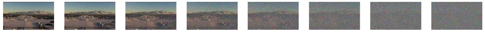
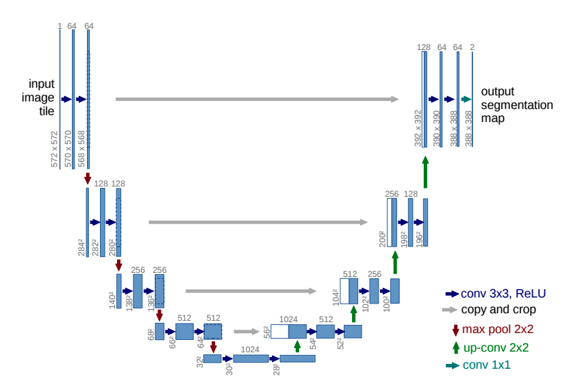

# Introduction

Aviation is regarded as highly safe medium of transportation, and is marked by high-degrees of automation, reducing the biggest cause (85% of the general aviation crashes) of accidents: pilot error [@li_factors_2001]. The increase in automation reduces cognitive, fatigue, and inexperience risks for pilots and is and important factor, alongside better training and safety regulations, to the to the rapidly decrease (1959-2024) in the fatal accidents rate [@airbus_fatal_nodate].

Although the approach and landing phases are the minority of the flight time, they contribute disproportionally to the number of accidents, this data being corroborated by the two major commercial airplane companies Boeing (7% in approach, 36% in landing) [@boeing_statistical_2024], and Airbus (59% in landing, 11% in approach) [@airbus_accidents_nodate].

Contributing as a risk-factor, the approach and landing phases are flight parts that require heavy human intervention. This has led to an increased interest in the development of autonomous landing (autoland) systems, which are systems that can autonomously navigate the civil aircraft or UAV (unmanned aerial vehicle, e.g. drones) during the landing procedure. Currently, most autoland systems are based on radio signals that provide guidance to the system, such as ILS (instrument landing system) and PAR (precision approach radar).

Radio-based autonomous landing systems have the advantage of allowing the landing in extremely adverse weather conditions and low visibility, but they have a high-cost of deployment and maintenance, can suffer from electromagnetic and radio interference, and require on-the-ground specialized equipment to support the aircraft (e.g. localizer and glideslope). (TODO: add reference?)

The recent advancements in the Computer Vision field have sparked increasing interest [@airbus_airbus_2021] in developing vision-based autoland systems, which use visual navigation to guide the aircraft during the approach and landing phases. In [@xin_vision-based_2022], the authors describe key advantages of vision-based autoland systems for UAV: autonomy, low cost, resistance to interference, and ability to be combined with other navigation methods for higher accuracy. Vision based landing is especially attractive for drones that often need to land in extreme situations when in military use, environmental monitoring, and disaster relief, where runways may not have the necessary equipment for radio-based systems.

Two key parts of a autonomous landing system is detection and segmentation of runways, the former being responsible for detecting the presence and locating the runway on the image by drawing a bounding box around the runway, and the latter, more granularly, works at the pixel-level, identifying the exact shape of the object on the image.

Detection and segmentation methods can be separated into two broad fields: traditional methods and deep-learning based methods. Traditional methods employ handcrafted features and mathematical rules to segment images, e.g. recognition of texture, line segments, and shape features of runways [@aytekin_texture-based_2013]  [@ye_research_2020]. They tend to be faster to run and not require training, but because they require handcrafted rules, they often fail to generalize to out-of-sample images and complex real-world scenarios that involve similar objects like roads and multiple runways and adverse weather conditions.

Compared to traditional methods, deep-learning based ones have shown improved generalization and performance on out-of-sample images, with the latest published runway segmentation papers all having used this approach and getting better results than traditional methods [@chen_image-based_2024]  [@wang_valnet_2024].

However, because of their data-hungry nature, previous research [@wang_valnet_2024]  [@chen_image-based_2024]  [@chen_bars_2023]  [@ducoffe_lard_2023] all note the lack of publicly available, high-quality, large, real-world datasets of aeronautical images to be used in the task of runway segmentation. To close this gap, the researchers have built and published datasets comprised of synthetic images collected from flight simulators such as X-Plane [@chen_bars_2023]  [@wang_valnet_2024], Microsoft Flight Simulator [@chen_image-based_2024], and images collected from Google Earth Studio [@ducoffe_lard_2023].

While these synthetic datasets have contributed to advancements in the field, there still an opportunity of an open-source, realistic, high-quality dataset that has runway image data encompassing a greater variety of weather and lighting conditions, environments and runway structures, and, even better, an open-source image generator that is capable of generating novel images or augmenting an existing dataset.

In recent years, striking advancements were made in the field of image generation models, with several closed-source and open-source models being published for general use, such as DALL-E [@betker_improving_nodate], Midjourney [@midjourney_midjourney_nodate], Kandinsky [@arkhipkin_kandinsky_2024], and Stable Diffusion [@rombach_high-resolution_2022]. These recently state-of-the-art models are latent diffusion models (LDM), which have surpassed in performance the previous state-of-the-art techniques that were based in generative adversarial networks (GANs). These image-generation models are now so capable of generating realistic images that researchers are studying the impacts of generative AI on the spread of fake news [@loth_blessing_2024].

These recent research advancements opened a new opportunity window to use synthetic data to close the gap on the lack of real images in object detection and segmentation tasks. There have already been progress in this idea applied to other areas such as medical images [@saragih_using_2024], urban applications [@reutov_generating_2023], and apple detection in orchards [@voetman_big_2023]. But up to my knowledge of public research, that has been no generative AI-based open-source dataset that could be used for the task of runway detection and segmentation.

To address the challenges of lack of data in the context of runway segmentation tasks, this paper introduces a novel, open-source, data augmentation technique based on a multi-step Stable Diffusion pipeline that extracts features existing datasets and outputs images that retain a similar structure but are customizable in respect to scenery, weather, and lighting conditions, guided by a text prompt. The images generated by the pipeline are already labeled and don't require handcraft labelling.

This technique is then used to construct a novel, large-scale, high-resolution, open-source, dataset of labeled runway images with good coverage of image variants in respect to weather, lighting, background, and runway occlusion.

This approach can greatly increase the availability of runway images to be used in other research projects, and, by virtue of being open-source, allow other researchers to generate and augment their own synthetic datasets with their own desired characteristics.

This new dataset is evaluated both theoretically by measuring the similarity of generated images to real images using metrics such as Fréchet Inception Distance (FID) and Structural Similarity Index (SSIM), and practically by introducing a runway detection and segmentation pipeline based on state-of-the-art models and comparing the performance of the model when training it with an existing dataset and when training with the new dataset.

The template chosen for this project is "Gather your own dataset". TODO: explain chapters.

# Literature Review

## Deep-learning based runway segmentation

In [@akbar_runway_2019], the authors give a broad literature review of the prior work on runway segmentation, that uses traditional methods and deep-learning methods. They break down the traditional methods into two categories: template-based and feature-based approaches, the former uses a template image that is compared to the actual image on a pixel-by-pixel basis, and the latter uses edges, corners, texture, and others to detect and localize the runway. They find that most works that use deep-learning methods are focused on airport detection, and not runway segmentation, showing their paper relevance.

They then propose a two-module pipeline, where the first module is responsible for detecting if a runway is present in the image and the second module is responsible for localizing the runway when it is present. For the detection module, they fine-tune a pre-trained ResNet50 model, achieving an accuracy of 97%. And for the localization module, they experiment with three approaches: hough transform, line segment detector, and a CNN, which performed with a localization score of 0.8 (mean Intersection-over-Union (IoU)).

The study shows that deep-learning methods are a valid and effective pathway to runway detection and segmentation, but there are significants shortfalls with it from a practical point of view on building a vision based landing system.  The top-down perspective from the satellite images of the used dataset (*"Remote Sensing Image Scene Classification"* [@cheng_remote_2017]) are unrealistic for fixed-wing aerial vehicles approach and landing, because the onboard system needs to detect and segment runways from the perspective of the aircraft. Secondly, there are no discussions on dataset diversity such as adverse weather and lighting conditions and the performance of the pipeline in those cases.

In [@chen_bars_2023], the authors note the lack of large-scale, publicly available datasets for the field of runway segmentation. Trying to alleviate this problem, they propose "*BARS: A Benchmark for Airport Runway Segmentation*", a 10256-image labeled runway dataset, with images collected from X-Plane, a FAA-certified flight simulator. The images were collected from several simulated flights under different weather and at different times, across 40 airports, to generate a diverse dataset and far more suitable for the task of vision based landing than the one used in [@akbar_runway_2019].

To test the efficacy of this new dataset, they experiment with several segmentation methods (e.g. Mask R-CNN, YOLACT, SOLO) and report the trained models' performance, that have a wide range of reported precisions (AP50 of 90.98 for the best performing one, and 62.18 for the worst performing one).

At the same time, using a simulator for generating synthetic images restricts the diversity of scenarios that can be produced (e.g. it is not possible to create scenarios in airports that are not included in the simulator). Also, because it is a closed-source simulator, it is not easy or accessible for other researchers to expand on this dataset by adding more diverse and unseen scenarios. And the manual labelling process using LabelMe [@mit_labelme_nodate] also increases the cost of reproducing or expanding the dataset. Another problem of the work is that the authors decided to publish their work on Baidu, which makes it impossible to access the full dataset without installing a third-party program on the computer.

The way the authors decided to test *BARS* experimentally highlights a situation that is similar to the problem encountered by Nobel-winning economist Eugene Fama on his work on Efficient Markets [@fama_efficient_1970] : the joint hypothesis problem. The joint hypothesis problem is the fact that all test of market efficiency are simultaneously tests of market efficiency and the asset pricing model that defines expected returns. Therefore, anomalous market returns might be due to market inefficiency, an inaccurate model, or both. 

Similarly, when proposing new datasets, one has to always be mindful that empiric tests of training models on this new datasets is always a joint test of the quality of this new dataset and the performance of the models being trained on it. A model's poor performance might indicate deficiencies in the dataset (e.g., lack of diversity, poor annotation quality, or unrealistic synthetic images), a reflection on the model's limitations of handling a more realistic dataset, with more complex tasks, or both. On the other hand, if a model performs really well, it doesn’t automatically prove that the dataset is good. It could just mean that the dataset happens to match what the model is already good at, without really testing how well it would work on real-world runway images.

In [@chen_image-based_2024], the authors propose *ERFE: efficient runway feature extractor*, a runway detection model that is able to extract semantic segmentation and feature lines. Also highlighting the difficulties of runway datasets, the authors propose a new synthetic image dataset *FS2020*, with images extracted from Microsoft's Flight Simulator 2020. They did have access to BARS, but argued that the images from X-Plane were unrealistic, especially in regards to ground texture and lighting condition. Their proposed dataset contains 5587 high-resolution (1920x1080) images, sampled from different runways, airplane positions, and lighting and weather conditions.

After image collection, the authors used the LabelMe toolbox to provide two types of annotation for each image: segmentation masks and feature lines with 6 categories (left edge, right edge, center line, aiming point front, threshold rear and PAPI lights).

The authors highlight the need for fast and accurate inference in the context of a fast-moving airplane. Thus, they chose to build a deep-learning model based on MobilenetV3, a convolutional neural network designed for mobile phone CPUs. They claim that their trained network has the capacity of processing 200 high-resolution images per second.

Their work excels in demonstrating the feasibility of an onboard runway segmentation system, and their FS2020 dataset is a rich contribution to the field, especially as it is accompanied by segmentation and feature lines labels. At the same time, it is a smaller dataset when compared to BARS, and because it is also based on a closed-source simulator, it has the same trade-offs associated to it. The authors also didn't compare their model's performance when trained with another dataset like BARS, which would make it easier to understand how well their dataset generalizes compared to others. Without this comparison, it is unclear whether their model performs well because of the dataset’s quality or simply because the dataset aligns well with the model’s training conditions. On the other hand, they chose to host the dataset on Kaggle, a widely used and known platform for hosting public datasets.

In [@ducoffe_lard_2023], the authors still highlight the lack of open-source datasets of aerial-images of runway and present a novel 17000 image dataset alongside an image generator. They use Google Earth Studio, positioning a camera inside the studio in the perspective of an airplane nose pointing to the runway. They publicly shared their generator scripts that automatically output labeled images without the need of human intervention. Alongside the generated synthetic data, they manually labeled real videos from airplanes landing.

Their method has considerable advantages over simulator-based ones: it is possible to reproduce and generate new images for virtually free, as Google Earth Studio is closed-source, but free tool, and the images are already labeled in the generation process. On the other hand, the images are less realistic than the simulator-based ones, as the ground texture is worse and it lacks different weather conditions and night view is simulated by a simple reduction in ambient brightness.

The authors don't train any detection or segmentation models based on the *LARD* dataset in the paper, but [@li_yolo-rwy_2024] did introduce YOLO-RWY, a YOLO-based [TODO:CITE YOLO] deep-learning model, and trained it using LARD, reporting that it has *"strong generalization and real-time capabilities"* [@li_yolo-rwy_2024]. The authors highlight how the limited nighttime and adverse weather samples in LARD may affect performance in extreme conditions, and they did include a data augmentation step in their training pipeline.

In [@wang_valnet_2024], the authors built VALNet, a model based on YOLO and that uses band-pass filters to be able to handle large-scale changes and input image angle differences in the context of runway segmentation. Among the reviewed papers on runway segmentation models, it is by far the most advanced, with a novel model architecture and extensive experiments comparing its results with other options, such as YOLOv8 and Mask R-CNN.

The paper also cited the dataset scarcity challenge, and proposes a new dataset called *RLD (Runway Landing Dataset)*, with 12239 images with a resolution of 1280x720. The images are sourced from X-Plane, similarly to the already reviewed BARS. The dataset was also manually labeled using LabelMe, and the dataset is also hosted on Baidu. Although it is the largest simulator-based dataset reviewed in this paper, it has the same advantages and disadvantages previously reviewed simulator-based datasets.

## Image generation models

GANs (generative adversarial networks), were introduced by [@goodfellow_generative_2014], and they consist of two neural networks, the Generator and the Discriminator, engaged in adversarial training. The generator is responsible for creating synthetic images (in the context of image GANs) and the discriminator is responsible for evaluating the authenticity of images. During training, the generator gets better at creating realistic images and the discriminator gets better at differentiating real from synthetic images.

In [@cohen_generative_2022], the authors give a survey on the main issues of GANs and their applications. They show how GANs can be effectively used for data augmentation, and with other GAN architectures such as Semi-supervised GAN (SGAN), there can be a model that outputs labeled images. But, GANs suffer from a well-known problem called "mode collapse", where the generator learns to produce only one or a few specific patterns that fool the discriminator, making the range of images generated by the model less diverse.

Diffusion models, introduced in [@ho_denoising_2020], are a generative approach based on iterative denoising. Diffusion models work by progressively adding noise to an image (called the forward process) and then training a network that learns how to remove noise from the image (the reverse process).



The intuition of Diffusion models is that, if a model can be trained to predict the noise in an image at a *timestep*, we can start at pure noise, then repeatedly call this model and remove the noise from the image, at each step making a less noisy image.

A key architecture used in diffusion models are U-Nets, introduced in [@ronneberger_u-net_2015]. The U-Net is composed of two parts: an encoder and a decoder. The encoder transforms the image into a compressed form that retains essential features. This compressed data is called a "latent". The decoder can then operate on this latent and output some data related to the input data. In the original paper, they used the U-Net to extract biomedical segmentation data. In Diffusion models, the U-Net is used as the model that predicts the noise from an image.



Although recently diffusion models have emerged as the new state-of-the-art architecture for image generation [@yang_diffusion_2024], they do have disadvantages. Namely, their inference time is slower than of GANs, they have a higher computational cost, and by themselves, they lack mechanisms for precise editing of the image aside from the text prompt.

This problem of controlling the generated image was tackled by [@zhang_adding_2023], that introduced ControlNet. ControlNet is a neural network that allows spatial conditioning to pre-trained text-to-image models. With it, it is possible to use canny edges, human poses, and segmentation masks to control the final result of the image. This allows greater control over the generation of synthetic images, such as the positioning of a runway in an image or control over the markings and detailed paintings on the runway.

## Synthetic datasets built with diffusion models

In [@saragih_using_2024], the authors cite a similar data scarcity problem in the field of medical images, specifically, gastrointestinal images. To solve this problem, they built a pipeline that used diffusion models to generate labeled gastrointestinal polyp images.

They started by clustering the training images and masks into 20 different clusters, and after that, training a four-channel (3 for RGB and a binary one for the mask) DDPM (Denoising Diffusion Probabilistic Models) model for each cluster. The models were trained with a fourth channel so that the model outputs an image and the associated mask along with it, requiring no human labelling. They used the RePaint [@lugmayr_repaint_2022] technique to guide the diffusion process so that the polyp was always generated in a specific area of the images, and they also used styling techniques so that the generated images were realistic. 

They compared the diffusion generated images with a GAN model generated images and found that the diffusion images were closer to real ones. The study trains several diffusion models to address the problem of large variation between images in the dataset, making each diffusion model "specialized" in generating images similar to its cluster. The paper shows promising results that we can augment image datasets with diffusion models, but only low resolution images were generated (256x256 pixels) and a larger variety of images would require training more independent models.

In [@reutov_generating_2023], the author explored using text-to-image diffusion model to generate urban traffic images for vehicles detection and classification. The author used the trained Kandinsky 2.2 model to generate images using prompt engineering, the practice of crafting a prompt so the image contains the necessary details. 192 different prompt variants were used to generate 1000 images with different combinations of traffic density, type of vehicle, location, weather condition, time of day, and camera location. The paper shows how far off-the-shelf models are capable of generating realistic images that can be used to train detection algorithms. But, it does not compare images generated by different models and the images have to be manually labeled. 

In [@voetman_big_2023], the authors studied the effectiveness of fine-tuning a pre-trained Stable Diffusion model for the purpose of generating datasets, applied to apple detection in apple orchards. They separated their baseline dataset into two datasets: green apples and red apples. After that, they fine-tuned two Stable Diffusion models with DreamBooth, and then generated a whole dataset. They used a trained apple detection model for baseline image annotations and then manually refined these annotations. To experimentally test the effectiveness of their datasets, they trained multiple YOLO object detectors on the baseline and synthetic datasets and compared the results. In their study, object detectors performed similarly when trained on their synthetic dataset and when trained on real images datasets. Their approach shows promising results in dataset generation with Stable Diffusion, although there is a lack of diversity (e.g. weather conditions, lighting conditions, different backgrounds, etc...) in both the baseline dataset that makes it easier to generate a synthetic dataset that is similar to the original.

## Evaluation of Synthetic Data

Across the previously mentioned works, two types of evaluation were common: theoretical similarity and experimental performance. Theoretical similarity were done using metrics such as FID (Fréchet Inception Distance) [@heusel_gans_2017] and SSIM (Structural Similarity Index) [@wang_image_2004], which measure the similarity between two images. Theoretical similarity was used to evaluate the synthetic datasets in [@saragih_using_2024]. Experimental performance, on the other hand, is about training a real model on the synthetic dataset and comparing the results. Experimental performance was used to evaluate the synthetic datasets in all runway segmentation papers covered in this review, except for LARD, and in [@reutov_generating_2023] and [@voetman_big_2023].

Both forms of testing are valid and have their trade-offs. Theoretical similarity is faster and easier to measure, but heavily depends on what images are included in the test. And if a dataset contains very different images' structures than the original, even if they are high-quality, the FID/SSIM give worse values. On the other hand, experimental performance tests the dataset in a realistic setting, evaluating how it will be used by other researchers, but suffers from the joint dataset-model problem covered previously.

# Design

## Project overview

The literature review has shown the importance of large-scale, public, and diverse datasets for deep-learning projects, specifically, in the field of runway detection and segmentation, where there is currently a lack of a dataset of real images with these characteristics. To address this challenge, previous work on the field has relied on synthetic data, mainly collected from flight simulators, which poses a significant cost barrier to the expansion of these datasets as these simulators are usually paid and closed-source, and the collected images require manual labelling.

At the same time, the emergence of diffusion models as the new state-of-the-art technique in image generation has opened a new window of opportunity in building synthetic datasets. Although this idea of using diffusion models to build synthetic datasets has been explored in other fields, there is no known work applying it to the runway segmentation research field.

This project's primary research question is how can a suitable synthetic image dataset be built for computational vision tasks without the need of images extracted from simulators or similar solutions. To answer this question, the project uses the field of vision-based landing and builds a synthetic runway image dataset.

The primary users of this project are researchers that may use the dataset and techniques provided in this project to build models for runway detection. Secondary users might be researchers interested in synthesizing their own datasets for computational vision tasks such as classification or segmentation.

With these end-users in mind, this projects delivers a two-fold contribution: a novel modular data augmentation pipeline that can increase the diversity of an existing dataset, while maintaining key features and structures; and using this data augmentation pipeline to generate a fully synthetic runway images dataset based on existing public datasets.

The proposed research question begs the question of what constitutes a "suitable synthetic image dataset". Here, we rank the following characteristics that make an image dataset suitable:

1. **Human-judged realism**: humans subjectively judge the images as credible and realistic. When comparing side-by-side the images of the generated dataset with other datasets, the perceived quality of the images are the same or better.
2. **Detection by existing models**: fine-tuned models on available datasets can detect the presence and segmentation of the desired data (runways in this project) in the images.
3. **Data diversity**: the dataset has good data diversity, including edge cases and several data variations.
4. **Model training**: an existing architecture can be trained on the dataset and achieve a reasonable performance or a pre-trained model can be fine-tuned and have their performance improved.

## Data augmentation pipeline

On earlier prototypes, several diffusion techniques such as prompt engineering, prompt weighting, unconditional image generation, inpainting and textual inversion were tried. Most of them failed to, standalone, generate realistic runway images with detailed and accurate markings. The most successful attempt was using ControlNet with an input canny edge, alongside well-crafted prompts to guide the text-to-image model. Because the canny edge was extracted from an existing runway image, the generated image faithfully respected the runway shape, position, markings and texture. Thus, the data augmentation pipeline is based around using a text-to-image diffusion model with ControlNet.

The data augmentation pipeline is composed of four separate modules, that can each be independently developed and improved, or totally replaced without affecting the overall functioning of the pipeline. This modularity and separation of concerns is good software engineering practice and aids on future research developing on this project.

**Template image selection module**: this step selects the "template images" that will be used in the pipeline. The template images are existing images in public datasets that are used to extract the overall structure of the image containing the runway to be used in the image generation step. Ideal template images have clear visibility of the runway and the surrounding background.  The output of this module is a folder with pairs of image files and label files.

**Edge extraction module**: this step uses the template images as input, processes them, and outputs canny edge images, to be used as inputs for ControlNet, alongside the according label for that image.

**Base Image generation module**: this step uses as inputs the canny edges, a list of text prompts, and a number of how many images should be generated for each pair of canny edge and prompt. It then uses a text-to-image model with ControlNet to generate base images. These images should be, similarly to the template ones, images with clear visibility of the runway and its surroundings. Thus, although we expect high-quality images as output, it will not be a diverse set of images. This module also outputs the labels for each image, adding metadata of what model, seed, and prompt was used.

**Variant image generation module**: this module uses as input the filtered base images and a list of "diversity prompts". These diversity prompts are text prompts designed to be an input to an image-to-image model, so that the base dataset generated can be expanded to have more diversity in terms of background scenery, weather, and lighting conditions.

## Evaluation

Following the standards of evaluation of synthetic datasets presented in the literature review, and our definition of what constitutes a suitable synthetic dataset, two types of evaluation will be done on the dataset: intrinsic and experimental evaluation.

Intrinsic evaluation measures the quality of a dataset by its intrinsic characteristics, such as image realism, resolution, diversity, and size. Ideally, to judge human-based realism, a group of subject experts would be assembled to judge the images, but because of time-constraints, this won't be done.

Instead, it will be replaced by metrics of image similarity between template images and the generated base images. Through metrics such as FID (Fréchet Inception Distance) and SSIM (Structural Similarity Index) it is possible to know how similar or different the images are from one another, and if they retain a similar structure such as the runway shape, position, and markings, and a similar background.

Other metrics such as size and image resolution will be reported. Data diversity will also be reported based on the generated images' text prompts. This doesn't guarantee full accuracy as there is a possibility of the model "hallucinating" and not generating a certain desired characteristic (e.g. rain, snow, runway occlusion), but nonetheless allows a good estimate to be reported.

Experimental evaluation is about using the dataset to train one or a collection of models and evaluating their performance empirically. It is an imperfect measurement, as there is a lot of moving parts when training a model, and, as seen on the literature review, a poor performance might be due to the dataset quality or an inherent flaw in the model's architecture. However, this type of evaluation is still widely used and a standard in testing synthetic datasets.

As it is not the focus of this project building a new architecture for runway segmentation, the experimental evaluation will be restricted to training and fine-tuning existing detection and segmentation models, such as YOLO.

Using a pre-trained segmentation model, comparisons will be made between the performance of training on this new synthetic dataset and of existing datasets, and the resulting performance when detecting a real images dataset. Also helping in assessing the realism of the images in the synthetic dataset, the accuracy of a model trained on an existing dataset trying to detect runways on the synthetic dataset will be reported.

# Implementation

## Pipeline

The pipeline is implemented through four Jupyter notebooks, one for each module. Additionally, a tool to help in filtering images is implemented in a standalone Python Script.
### Template image selection module

The template image selection module contains an adapter function that reads images from the public LARD dataset [@ducoffe_lard_2023], generate JSON label files, and puts the image-label files pairs into the output directory. The LARD dataset is composed of several different folders containing both synthetic and real images. It has two real images folders: *Nominal cases* and *Edge cases*, the latter being composed of images with poor runway visibility.

Given that the template images are used to extract canny edges, it is better to use images with clear runway and surrounding area visibility, thus the *Nominal cases* folder, with 1500 images, was chosen.

The images are then processed to be squared images, as they stable diffusion naturally works with square images. The runway is horizontally centered so as to not be out of frame when cropping into a square. The following code does this:

```py
xs = [p[0] for p in pts]
ys = [p[1] for p in pts]
min_x, max_x = min(xs), max(xs)
min_y, max_y = min(ys), max(ys)

# Vertical crop is the entire height
top = 0
bottom = H

# Horizontal positioning for H-wide crop
center_x = (min_x + max_x) / 2.0
ideal_left = int(round(center_x - (H / 2)))
left = max(0, min(ideal_left, W - H))
right = left + H

cropped_img = img.crop((left, top, right, bottom))
```

Then, the new shifted runway corners' key-points are computed to build a JSON label:

```py
shifted_pts = [(p[0] - left, p[1] - top) for p in pts]

# Build label
image_label = ImageLabel(
	dataset="LARD/LARD_test_real_nominal",
	sourceImage=os.path.basename(image_path),
	runwayLabel=shifted_pts
)
```

Finally, the image label is converted to JSON and it and the cropped images are saved to the output folder.
### Edge extraction module

The edge extraction module contains a generator function that take an input directory, and output a directory with corresponding canny edge images with a 1024x1024 resolution. The generator function uses a image processor from a ControlNet Auxiliar library to generate the canny edges, and resizes to the desired resolution:

```py
from controlnet_aux.processor import Processor

processor = Processor(
	'canny',
	{
		"detect_resolution": 756,
		"image_resolution": 1024
	}
)

pil_in = Image.open(image_path).convert("RGB")
canny_pil = processor(pil_in, to_pil=True).resize((1024, 1024))

```

To help in the image generation process, a polygon is drawn into the image to delimiter the area of the runway:

```py 
cv2.polylines(
	canny_array,
	[corners_sorted.astype(np.int32)],
	isClosed=True,
	color=(255, 255, 255),
	thickness=2
)
```

Finally, the corners are scaled to this new image resolution, and saved to the new label file:

```py
orig_h, orig_w = image_bgr.shape[:2]
corners_array = np.array(runway_corners, dtype=np.float32)
corners_array[:, 0] *= (1024.0 / orig_w)
corners_array[:, 1] *= (1024.0 / orig_h)
```
### Base Image generation module

```py
controlnet = ControlNetModel.from_pretrained(
    "diffusers/controlnet-canny-sdxl-1.0", torch_dtype=torch.float16
)

pipeline = StableDiffusionXLControlNetPipeline.from_pretrained(
    "lykon/dreamshaper-xl-v2-turbo",
    torch_dtype=torch.float16,
    variant="fp16",
    controlnet=controlnet
).to("cuda")
pipeline.scheduler = DPMSolverMultistepScheduler.from_config(pipeline.scheduler.config, algorithm_type="sde-dpmsolver++", use_karras_sigmas=True)

pipeline.enable_model_cpu_offload()
```


```py
base_prompt = "photo of airport runway, aerial view, 4k, cinematic film still, realistic, beautiful landscape around, high-contrast runway lines"

base_neg = "airplane, ugly, low-quality, ugly background, ugly airstrip, deformed, dark, noisy, blurry, low contrast, missing lines, unrealistic, drawing, objects on runway"

modifiers = {
    "rain": (
        "+raining +storm +wet",
        "-dark -noisy -blurry",
    ),
    "fog": (
        "+(harsh fog) +mist +haze",
        "-dark -noisy -blurry",
    ),
    "snow": (
        "+snowing",
        "",
    ),
    "dusk": (
        "+(at dusk)",
        "",
    ),
    "dawn": (
        "+(at dawn)",
        "",
    ),
    "night": (
        "+(at night)",
        "-dark",
    )
}

```

```py
generate_base_images(
    "p_FilteredCannyEdges",
    "p_BaseImages",
    prompt_pairs=[
        apply_modifiers("day", [], 5),
        apply_modifiers("night", ["night"], 5),
        apply_modifiers("dusk", ["dusk"], 1),
        apply_modifiers("dawn", ["dawn"], 1),
        apply_modifiers("fog", ["fog"], 1),
        apply_modifiers("fog+night", ["night", "fog"], 1),
        apply_modifiers("rain", ["rain"], 1),
        apply_modifiers("rain+night", ["night", "rain"], 1),
        apply_modifiers("snow", ["snow"], 1),
        apply_modifiers("snow+night", ["night", "snow"], 1),
    ],
    model_name="sdxl-dreamshaperxl",
    # show=True
)
```

### Variant image generation module

To generate variant images, we run three pipelines: a positional variant augmentation, outpainting borders, and weather occlusion effects.

The first pipeline uses the *Albumentations* [TODO: cite] library to run three transformations: randomly horizontally flip images, padding images with a border (to make it look like the runway is more distant), and slight random rotation from -25 degrees to 25 degrees. 

```py
pipeline = A.ReplayCompose(
    [
        A.HorizontalFlip(p=0.5),
        A.CropAndPad(
            px=((51, 410),  # top
                (51, 410),  # bottom
                (51, 410),  # left
                (51, 410)), # right
            keep_size=False,
            p=1.0
        ),
        A.Affine(rotate=(-25, 25), p=1.0),
    ],
    keypoint_params=A.KeypointParams(format='xy', remove_invisible=False)
)
```

![[albumentations.png]]

The positional variant pipeline generates images with black borders, and the second pipeline uses the *inpainting* technique to extend the original image into the black border. First, inpainting is done using OpenCV filling the black border with colors that look from the nearby image region. Then, a Stable Dfifusion model is used to improve the border to blend in better with the original image.

The algorithm used to in the first inpaint is the algorithm proposed by Alexandru Telea [cite], implemented by OpenCV through the `cv2.inpaint` method with the `cv2.INPAINT_TELEA` flag:

```py
mask = np.all(image == 0, axis=2).astype(np.uint8) * 255
kernel = np.ones((3, 3), np.uint8)
mask = cv2.dilate(mask, kernel, iterations=4)
image = Image.fromarray(cv2.cvtColor(cv2.inpaint(image, mask, 3, cv2.INPAINT_TELEA), cv2.COLOR_BGR2RGB))
```

TODO: Put image here:

After this initial inpainting, a Stable Diffusion XL Inpainting pipeline is used to process the image. The original prompt and negative prompt used to generate the base image is used here, along with a blurred mask so that the image blends better with the border.

*Inpainting modifies an existing image. It takes a mask that shows where the model should change the image. The model then tries to generate the content in the masked out area consistent with the surrounding pixels and the given prompt. It can be used to transform a scenery image into a runway image.*

```py
pipe = StableDiffusionXLInpaintPipeline.from_pretrained(
    "lykon/dreamshaper-xl-lightning",
    torch_dtype=torch.float16,
    variant="fp16",
).to("cuda")
pipe.scheduler = DPMSolverMultistepScheduler.from_config(pipe.scheduler.config)

# [...]

mask = pipe.mask_processor.blur(Image.fromarray(mask), blur_factor=75)

result = pipe(
	prompt=data["prompt"],
	negative_prompt=data["negative_prompt"],
	image=image,
	mask_image=mask,
	strength=0.8,
	generator=generator,
	
	num_inference_steps=30,
	guidance_scale=2,
).images[0]
```

The third, and final pipeline reads the images outputted by the last pipeline and creates a new separate folder with the same images, but augmented with weather occlusion effects done by the `imgaug` library (TODO: cite). Effects are added depending on the variant used to generate the base images:
- Clouds for pure "day/night/dusk/dawn" base images
- Fog for "fog" base images
- Rain for "rain" base images
- Snowflakes for "snow" base images

The imgaug library have these effects built in:

```py
if variant in ["day", "night", "dusk", "dawn"]:
	aug = iaa.SomeOf((1, 2), [
		iaa.CloudLayer(...),
		iaa.CloudLayer(...),
	])
	image = aug(image=image)
	applied_effects.append("clouds")
elif variant in ["fog", "fog+night"]:
	aug = iaa.CloudLayer(...)
	image = aug(image=image)
	applied_effects.append("fog")
elif variant in ["rain", "rain+night"]:
	aug = iaa.Rain(drop_size=(0.1, 0.2), speed=(0.01, 0.05))
	image = aug(image=image)
	applied_effects.append("light_rain")
elif variant in ["snow", "snow+night"]:
	aug = iaa.Snowflakes(flake_size=(0.1, 0.3), speed=(0.01, 0.05))
	image = aug(image=image)
	applied_effects.append("snowflakes")
```

After each augmentation pipeline, the label JSON file is enriched with enough information to ensure the process reproducibility, along with the random seeds used in the process.
### Filtering Tool

To aid in selecting which images to use as template images, a manual filtering tool was written as a python script using OpenCV. This tool read images from a directory and allows the user to press "Space" to select an image and "X" to discard them. The selected images are copied into a new directory, and progress is written to a log file so that it is possible to close the tool and open again without having to restart the process all over again.

Because I had limited time, template images were filtered using this heuristic:
1. Use all images from `LARD_test_real_nominal` as template images, and pass them through the extract canny edge and base image generation modules, generating one daylight base image per template image.
2. Then, use the filtering tool to select which base images had easily recognizable runways with consistent markings and structure.
3. In the end, 361 images were selected, and then only these canny edges were used to generate all images in the final dataset.

## Generated images


# Evaluation

# Conclusion


# References
